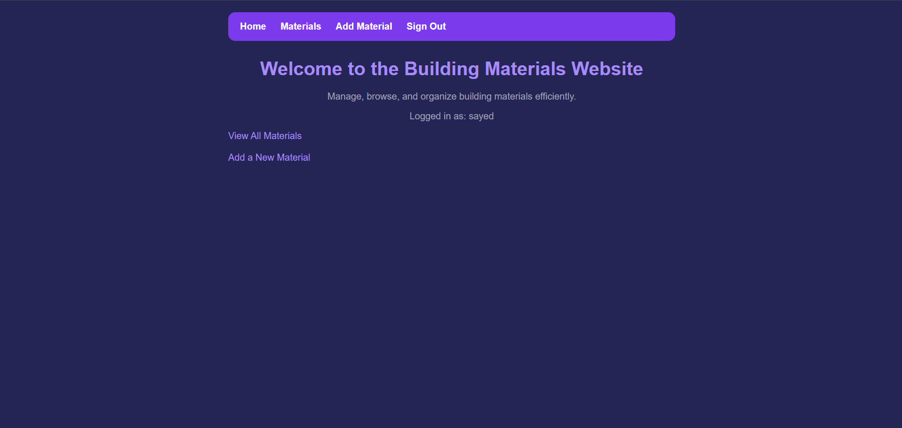
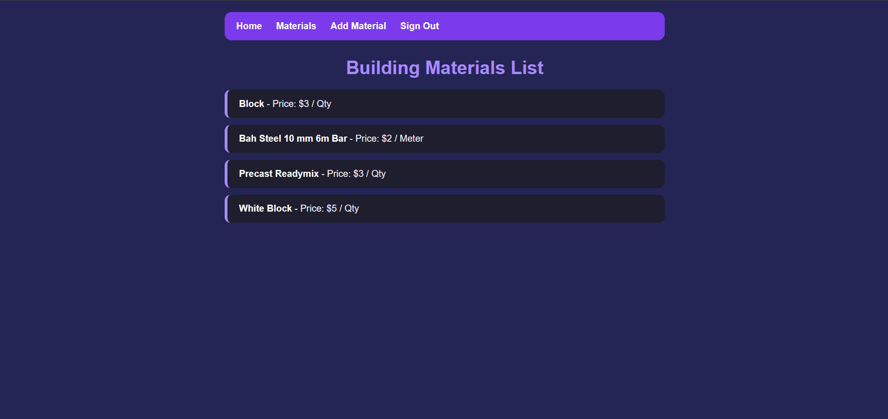
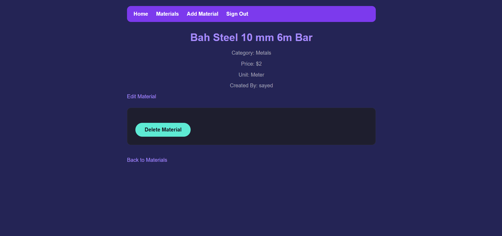

# Project Name

Building Materials

## Description
This is a web application to manage building materials. Users can create an account, sign in, and browse a full list of materials along with their category, price, unit, and creator details. Signed-in admins can create new materials, edit existing details, and delete materials from the system.

## Screenshots

## Technologies Used
1. HTML
2. CSS
3. JavaScript
4. Node.js
5. Express
6. MongoDB and Mongoose
7. EJS
8. Bcrypt

## User Stories
1. As a User, I want to create an account so I can access the system.
2. As a User, I want to sign in and sign out securely.
3. As a User, I want to browse a list of all available building materials with their price and unit.
4. As a User, I want to click on a material to view its detailed view, including category, price, unit, and creator.
5. As an Admin, I want to add new materials with a name, category, price, and unit.
6. As an Admin, I want to edit material details to keep the inventory accurate.
7. As an Admin, I want to delete materials that are no longer needed.
8. As a User, I want the navigation bar to dynamically adjust based on whether I am logged in or an admin.

## Database Design(ERD)

- **User:** username, password, phone, role (`User` or `Admin`)
- **Category:** name, description
- **Material:** name, category (linked to Category), price, unit, createdBy (linked to User)

## Routes

| Route | Method | Description |
|---|---|---|
| `/` | GET | Home page |
| `/auth/sign-up` | GET / POST | Render sign-up form / Create new account |
| `/auth/sign-in` | GET / POST | Render sign-in form / Authenticate user session |
| `/auth/sign-out` | GET | Destroy session and sign out |
| `/materials` | GET | Display list of all materials |
| `/materials/new` | GET | Render form to create a new material (Admin) |
| `/materials` | POST | Save a new material to the database (Admin) |
| `/materials/:id` | GET | Display detailed information for a single material |
| `/materials/:id/edit` | GET | Render form to edit an existing material (Admin) |
| `/materials/:id` | PUT | Update material details in the database (Admin) |
| `/materials/:id` | DELETE | Remove a material from the database (Admin) |

## Future Improvements
1. Add a search bar to find materials by name
2. Add filter by category
3. Add images for each material
4. Add a page for admins to manage categories
5. Add a shopping cart
6. Add price calculator